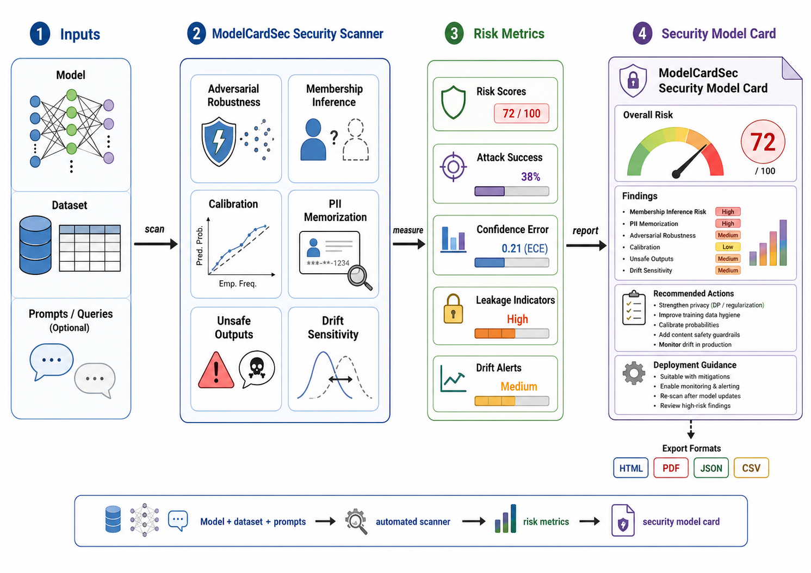

# ModelCardSec: Automated Privacy and Security Risk Profiling for ML Models


ModelCardSec is a small, reproducible research prototype that scans machine-learning models before deployment and generates a **security model card**. It produces metrics for robustness, membership-inference exposure, calibration, PII leakage, unsafe-output signals, and deployment-drift sensitivity.

The project is designed to be easy to demo for a systems/security paper:

```text
model + dataset -> ModelCardSec scanner -> risk metrics -> security model card
```



## What is included

- A Python package: `modelcardsec/`
- A command-line interface: `modelcardsec demo` and `modelcardsec audit`
- Six scanner modules:
  - adversarial/noise robustness
  - membership inference risk
  - calibration error
  - PII memorization and leakage heuristics
  - unsafe output keyword screening
  - covariate drift sensitivity
- Report generators for Markdown, HTML, and PDF
- Demo experiment over multiple scikit-learn models
- Result-panel generation:
  - Panel A: risk scores across models
  - Panel B: time saved versus a manual audit estimate
  - Panel C: correlation between aggregate risk score and attack success proxy
- A paper skeleton in `paper/main.tex`
- Unit tests in `tests/`

## Why this project matters

Security teams need practical, repeatable evidence before an ML model is deployed. MITRE ATLAS describes adversarial AI tactics, techniques, mitigations, and case studies. NIST AI RMF emphasizes trustworthy AI characteristics such as secure, resilient, privacy-enhanced, valid, reliable, transparent, and accountable systems. OWASP's LLM guidance highlights risks such as prompt injection, sensitive information disclosure, excessive agency, and unsafe outputs. ModelCardSec turns these high-level concerns into an automated checklist-style scanner and a deployment report.

## Quick start

```bash
python -m venv .venv
source .venv/bin/activate
pip install -e .[dev]
python -m modelcardsec.cli demo --out reports/demo
```

After the demo runs, open:

- `reports/demo/modelcardsec_report.html`
- `reports/demo/modelcardsec_report.pdf`
- `reports/demo/metrics_summary.csv`
- `reports/demo/panel_a_risk_scores.png`
- `reports/demo/panel_b_time_saved.png`
- `reports/demo/panel_c_risk_vs_attack.png`

## Run the packaged CLI

```bash
modelcardsec demo --out reports/demo
```

or with a config file:

```bash
modelcardsec audit --config configs/example_tabular.yaml --out reports/config_run
```

## Repository layout

```text
ModelCardSec/
├── modelcardsec/              # Python package
│   ├── scanners/              # Individual security/privacy scanners
│   ├── templates/             # HTML report template
│   ├── audit.py               # Audit orchestration
│   ├── cli.py                 # CLI entrypoint
│   ├── demo.py                # Reproducible demo experiment
│   ├── metrics.py             # Shared metrics
│   ├── reporting.py           # Markdown/HTML/PDF/figure generation
│   └── risk.py                # Aggregate scoring
├── configs/                   # Example YAML config
├── docs/                      # Manual checklist baseline and usage notes
├── examples/                  # Small runnable scripts
├── paper/                     # LaTeX manuscript skeleton
├── tests/                     # Unit tests
└── reports/demo/              # Generated demo output after running
```

## Research claims you can evaluate

1. **Automated coverage:** a repeatable scanner can produce security-card evidence without requiring each auditor to manually execute each test.
2. **Risk ranking:** aggregate ModelCardSec scores should rank vulnerable models higher than stable models.
3. **Attack correlation:** model-level risk scores should correlate with observed attack-success proxies such as prediction flips under perturbation and confidence-based membership-inference advantage.
4. **Audit time savings:** an automated pass can generate the same checklist evidence faster than a manual baseline.

## Citation and framework references

The README and paper skeleton reference:

- MITRE ATLAS: adversarial AI tactics, techniques, mitigations, case studies, and tools.
- NIST AI Risk Management Framework: trustworthy AI risk management characteristics and profiles.
- OWASP Top 10 for LLM Applications: practical application security risks relevant to generative and agentic ML deployments.

## Limitations

ModelCardSec is a research prototype, not a production certification tool. The default demo uses tabular models and lightweight attacks so the project can run quickly on a laptop. For production, replace the simple scanners with stronger threat-model-specific tests, expand domain-specific policies, and validate risk thresholds with security stakeholders.

## Example output

The demo report contains a model-level summary table like:

| Model | Aggregate risk | Robustness | Membership | Calibration | Drift |
|---|---:|---:|---:|---:|---:|
| Logistic Regression | generated | generated | generated | generated | generated |
| Random Forest | generated | generated | generated | generated | generated |
| Decision Tree | generated | generated | generated | generated | generated |

## License

MIT License. See `LICENSE`.
